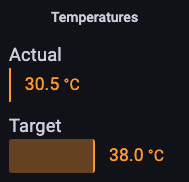
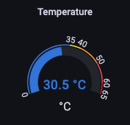
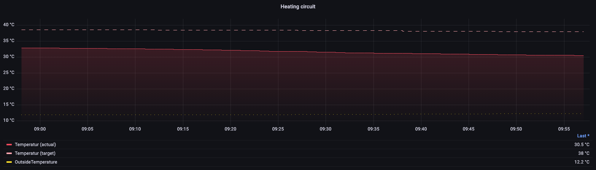

# Monitoring Pellematic Condens
Gets data of an ÖkoFEN Pellematic Condens pellet stove via JSON API by a python script and sends it to an InfluxDB.

## Description
The script collects the data the JSON API provides (see below), manipulates it if necessary and afterwards sends it to an InfluxDB. This data can be used to be visualized e.g. by Grafana to display it in panels/dashboards. The JSON API needs to be activated and configured directly on the stove. 

To collect the data regularly (I recommend at least every minute), you can decide yourself how to trigger the script, e.g.:
- by inserting it into native `crontab` on a linux machine
- by using a custom scheduled task on a NAS like Synology or Qnap
- any other way you like which fits your needs

## Requirements
- python (3.x)
- InfluxDB (1.8.x)

## Usage
Download or clone this repository into any folder, adjust the `_user.ini` file, setup InfluxDB as described below and call the script:
- local/relative from within the folder: `python3 pellematic.py`
- absolute with path to python executable: `/usr/bin/python3 /my-folder/monitor_oekoFEN/pellematic.py`

### Configuration
If no `_user.ini` is present, the default configuration will be used:
```
[influxDB]
# Name of the database (default: oekofen)
#database =
# Host for the connection - IP or hostname (default: 127.0.0.1)
#host =
# Measurement where data is stored (default: pellematic)
#measurement =
# Password for the connection (default: empty)
#password =
# Port for the connection (default: 8086)
#port =
# User for the connection (default: empty)
#user =

[source]
# Set to True to get some debug output in CLI
debug = False
# Define fields (comma separated) which data should be collected - leave blank to collect all (see README.md for available fields)
fields =
# IP for connection to AC ELWA-E (required)
ip =
# Define parts (comma separated) which data should be collected - leave blank to collect all (see README.md for available parts)
parts = hk1, pe1, pu1, se1, sk1, ww1, weather
# JSON Password for the connection
password =
# JSON Port for the connection (default: 4321)
#port =
```
#### Default values (for better readability)
```
[influxDB]
database = oekofen
host = 127.0.0.1
measurement = pellematic
password =
port = 8086
user =

[source]
debug = False
fields =
ip =
parts = hk1, pe1, pu1, se1, sk1, ww1, weather
password =
port =
```
Each of these values can be overriden by taking that part into the `_user.ini` file located in the same folder as the `_config.ini`. So if you like to change the name of the database, use credentials and collect only the fields `L_state`, `L_starts` and `L_runtime` from part `pe1` as well as the fields `L_tpo_act`, `L_tpo_set`, `L_state` from part `pu1`:
```
[influxDB]
database = energy_oekofen
password = myPassword
user = myUser

[source]
fields = pe1|L_state, pe1|L_starts, pe1|L_runtime, pu1|L_tpo_act, pu1|L_tpo_set, pu1|L_state
ip = 0.0.0.0
parts = pe1, pu1
```
As you have to specify at least the IP address and JSON password of your pellet stove for a working setup, I absolutely recommend it to go this way.

## Setup
This is just a suggestion how a setup could look like. Feel free to adjust it to your needs or prerequisites. I already use Grafana to visualize data, therefore the docker image is mentioned down below.

### InfluxDB
- Official docker image of [influxdb:1.8](https://hub.docker.com/layers/library/influxdb/1.8/images/sha256-c436689dc135f204734d63b82fd03044fa3a5205127cb2d1fa7398ff224936b1?context=explore)
    - map local port 8086 to container port 8086
    - bind volume to store data on local device `/path/to/local/folder:/var/lib/influxdb`
    - create database `oekofen` (database has to exist, will not be created by this script -> `CREATE DATABASE oekofen` - see [Testing](#Testing)
- Official docker image of [grafana/grafana:latest](https://hub.docker.com/layers/grafana/grafana/latest/images/sha256-f5518c6c6392bb767813b78d474ed3a228ca0673f1867770d8fd312067abc558?context=explore)
    - map local port 3000 to container port 3000
    - bind volume to store data on local device `/path/to/local/folder:/var/lib/grafana`

## Testing
Log into you InfluxDB to check whether the data is stored correctly. If you use it within a docker image, you need to SSH into the container first - otherwise skip first step:
1. `docker exec -it <INFLUXDB_CONTAINER_NAME> bash`
2. `influx`
3. `SHOW DATABASES`
    - if there is no database named `oekofen` you must create it: `CREATE DATABASE oekofen`
4. `USE oekofen`
5. `SHOW MEASUREMENTS`
    - there should be exactly one measurement named `pellematic` after executing the script for the first time if you use the default configuration
6. `SELECT * FROM pellematic ORDER BY time LIMIT 1`
    - depending on how many fields you collect, you will see x values with a timestamp when they were collected
7. `SHOW FIELD KEYS FROM pellematic`
    - show types of collected fields (float, integer, string)

## Status
I use this script to monitor my pellet stove once a minute via `task scheduler` on a Synology NAS DS720+. Grafana and InfluxDB are running in a docker container each.

### Roadmap/Still to come
- Grafana panels & dashboards

## Grafana
### Heating circuit panels
First section of panels is related to the heating circuit (`hk1` - can also be adopted to `hk2` which does not exist in my setup). They display the actual (`L_flowtemp_act`) and target (`L_flowtemp_set`) temperatures ([json](grafana/panels/pellematic_heating-circuit_temperatures.json)) of the heating circuit as well as the state of the pump (`L_state`) ([json](grafana/panels/pellematic_heating-circuit_pump.json)).





There is a `time series` graph ([json](grafana/panels/pellematic_heating-circuit.json)) as well, showing the above temperatures in relation to the outside temperature (`L_ambient` from the `system` part).



All panels can be found within `grafana/panels`. Feel free to import into your dashboards and adjust to your needs.

## Pellematic Condens
The data is provided via a JSON API which you can call via `http://<IP>>/<JSON_PASSWORD>/all?`. The following parts & fields are provided by a device (field `L_type` [6:CONDENS] in part `pe1`) with the following version: Touch V4.00b.

Following a list of all parts & fields of my device (alphabetically ordered, explanations of fields still to come):
- hk1
  - L_comfort
  - L_flowtemp_act (`float`: actual temperature)
  - L_flowtemp_set (`float`: target temperature)
  - L_pump (`integer`: Off[0]|On[1])
  - L_roomtemp_act
  - L_roomtemp_set
  - L_state
  - L_statetext (`string`: text of state, e.g. in german 'Heizbetrieb aktiv')
  - autocomfort
  - autocomfort_sunrise
  - autocomfort_sunset
  - mode_auto
  - name
  - oekomode
  - remote_override
  - temp_heat
  - temp_setback
  - temp_vacation
  - time_prg
- pe1
  - L_ak
  - L_avg_runtime
  - L_br
  - L_currentairflow
  - L_ext_temp
  - L_fluegas
  - L_frt_temp_act
  - L_frt_temp_end
  - L_frt_temp_set
  - L_lowpressure
  - L_lowpressure_set
  - L_modulation
  - L_not
  - L_resttimeburner
  - L_runtime
  - L_runtimeburner
  - L_starts
  - L_state
  - L_statetext
  - L_stb
  - L_storage_fill
  - L_storage_max
  - L_storage_min
  - L_storage_popper
  - L_temp_act
  - L_temp_set
  - L_type
  - L_uw
  - L_uw_release
  - L_uw_speed
  - mode
  - storage_fill_today
  - storage_fill_yesterday
- pu1
  - L_pump
  - L_pump_release
  - L_state
  - L_statetext
  - L_tpm_act
  - L_tpm_set
  - L_tpo_act
  - L_tpo_set
  - ext_mintemp_off
  - ext_mintemp_on
  - mintemp_off
  - mintemp_on
- se1
  - L_counter
  - L_day
  - L_flow
  - L_flow_temp
  - L_pwr
  - L_ret_temp
  - L_total
  - L_yesterday
- sk1
  - L_koll_temp
  - L_pump
  - L_spu
  - L_state
  - L_statetext
  - cooling
  - mode
  - name
  - spu_max
- system
  - L_ambient (`float`: outside temperature)
  - L_errors
  - L_usb_stick
  - L_existing_boiler
- weather
  - L_clouds
  - L_endtime
  - L_forecast_clouds
  - L_forecast_temp
  - L_forecast_today
  - L_location
  - L_source
  - L_starttime
  - L_temp
  - cloud_limit
  - hysteresys
  - lead
  - oekomode
  - offtemp
  - refresh
- ww1
  - L_offtemp_act
  - L_ontemp_act
  - L_pump
  - L_state
  - L_statetext
  - L_temp_set
  - heat_once
  - mode_auto
  - mode_dhw
  - name
  - oekomode
  - sensor_off
  - sensor_on
  - smartstart
  - temp_max_set
  - temp_min_set
  - time_prg
  - use_boiler_heat

Due to the fact that the setup is different on each building, there might be installations with more (`hk2` is a second heating circuit) or less (`se1` and `sk1` are solar heat related) parts being active and submitted via JSON API.
If anyone has a tip for me on where to find official data on what each field means, feel free to contact me!

## Inspiration/Thanks
In September 2022 I searched the web for a possibility to get the data for my ÖkoFEN Pellematic Condens and persist it. The reason was and still is the optimzation of the stove, the pellet consumption and energy consumption in general - as it's getting more expensive.

I finally found [Oekofen-spy](https://gitlab.com/p3605/oekofen-spy) on GitLab which introduced me into Python and InfluxDB and that let me to this project. I tried to adapt this to my needs, make it somehow more configurable and less error prone for future API updates from ÖkoFEN - mainly regarding the conversion of the values to float within `convertFieldValues()`.
